# 🫁 CheXNet Pro AI — Hệ Thống CADx Đa Mô Hình Chẩn Đoán Hình Ảnh X-Quang Lồng Ngực

[](https://pytorch.org/)
[](https://fastapi.tiangolo.com/)
[](https://react.dev/)
[](https://github.com/ultralytics/ultralytics)
[]()

**CheXNet Pro AI** là hệ thống **CADx (Computer-Aided Diagnosis)** hỗ trợ chẩn đoán hình ảnh X-quang lồng ngực tiên tiến, phân loại đồng thời **15 nhãn bệnh lý** (14 bệnh lý phổi phổ biến + *No Finding*). Dự án kết hợp đột phá giữa bộ phân loại toàn cục **Hybrid CNN-ViT (ConvNeXtV2-Large + SwinV2-Large)** và bộ định vị tổn thương **YOLO11m**, đồng thời ứng dụng kỹ thuật độc quyền **Cascade 2-Stage Filter** và **Display Fusion** để giải quyết triệt để xung đột giữa Attention Heatmap và Bounding Box trên giao diện y khoa lâm sàng.

---

## 📑 Mục Lục
- [🌟 Tính Năng Nổi Bật](#-tính-năng-nổi-bật)
- [🏗️ Kiến Trúc Hệ Thống Chi Tiết](#️-kiến-trúc-hệ-thống-chi-tiết)
  - [1. Sơ đồ Tổng Quan Toàn Bộ Dự Án (End-to-End System Overview)](#1-sơ-đồ-tổng-quan-toàn-bộ-dự-án-end-to-end-system-overview)
  - [2. Chi Tiết Cách Làm Việc Của Model Hybrid (ConvNeXtV2 + SwinV2)](#2-chi-tiết-cách-làm-việc-của-model-hybrid-convnextv2--swinv2)
  - [3. Chi Tiết Cách Làm Việc Của Model YOLO (YOLO11m Lesion Detector)](#3-chi-tiết-cách-làm-việc-của-model-yolo-yolo11m-lesion-detector)
  - [4. Cơ Chế Hợp Nhất Đa Mô Hình (Cascade & Display Fusion)](#4-cơ-chế-hợp-nhất-đa-mô-hình-cascade--display-fusion)
  - [5. Khối Trí Tuệ Lâm Sàng & Phân Tích Chuyên Sâu](#5-khối-trí-tuệ-lâm-sàng--phân-tích-chuyên-sâu)
  - [6. Chi Tiết Cách Vận Hành Của Hệ Thống Web (Full-Stack Serving)](#6-chi-tiết-cách-vận-hành-của-hệ-thống-web-full-stack-serving)
  - [7. Luồng Hoạt Động Quá Trình Huấn Luyện (Training Pipelines)](#7-luồng-hoạt-động-quá-trình-huấn-luyện-training-pipelines)
    - [A. Quá Trình Huấn Luyện Model Hybrid](#a-quá-trình-huấn-luyện-model-hybrid)
    - [B. Quá Trình Huấn Luyện Model YOLO11m](#b-quá-trình-huấn-luyện-model-yolo11m)
- [💻 Công Nghệ Sử Dụng Trong Dự Án](#-công-nghệ-sử-dụng-trong-dự-án)
- [📂 Cấu Trúc Thư Mục Dự Án](#-cấu-trúc-thư-mục-dự-án)
- [🔬 Đột Phá Kỹ Thuật & Tối Ưu Hóa Bộ Nhớ](#-đột-phá-kỹ-thuật--tối-ưu-hóa-bộ-nhớ)
- [📊 Báo Cáo Đánh Giá Thực Nghiệm (Results Report)](#-báo-cáo-đánh-giá-thực-nghiệm-results-report)
  - [1. Đánh giá trên tập dữ liệu NIH Chest X-ray (Mean AUROC: 0.8895)](#1-đánh-giá-trên-tập-dữ-liệu-nih-chest-x-ray-mean-auroc-08895)
  - [2. Đánh giá trên tập dữ liệu Hybrid (NIH + VinDr-CXR) (Mean AUROC: 0.8758)](#2-đánh-giá-trên-tập-dữ-liệu-hybrid-nih--vindr-cxr-mean-auroc-08758)
- [🏆 Thử Nghiệm Demo Đa Mô Hình (Results/EX)](#-thử-nghiệm-demo-đa-mô-hình-resultsex)
- [🚀 Hướng Dẫn Khởi Chạy & Trải Nghiệm Demo](#-hướng-dẫn-khởi-chạy--trải-nghiệm-demo)
  - [Bước 1: Cài đặt Môi trường](#bước-1-cài-đặt-môi-trường)
  - [Bước 2: Chạy Demo CLI (Đa Mô Hình Kèm Bounding Box)](#bước-2-chạy-demo-cli-đa-mô-hình-kèm-bounding-box)
  - [Bước 3: Chạy Dự Đoán Tương Tác Ảnh Bất Kỳ](#bước-3-chạy-dự-đoán-tương-tác-ảnh-bất-kỳ)
  - [Bước 4: Khởi Chạy Full-Stack Serving (FastAPI + React UI)](#bước-4-khởi-chạy-full-stack-serving-fastapi--react-ui)
- [📚 Danh Mục Bệnh Lý Nhận Diện](#-danh-mục-bệnh-lý-nhận-diện)

---

## 🌟 Tính Năng Nổi Bật

1. **Kiến trúc Lai Tiên Tiến (Hybrid CNN-ViT)**:
   - **ConvNeXtV2-Large**: Nắm bắt đặc trưng chi tiết cục bộ đa tầng (Local Textures, viền bờ tổn thương).
   - **SwinV2-Large**: Khai thác ngữ cảnh giải phẫu toàn cục (Global Context, đối xứng hai phế trường).
   - **FPN Decoder & 15-Channel Attention Head**: Hòa trộn đặc trưng đa tỷ lệ, cung cấp 15 bản đồ nhiệt phân giải cao độc lập cho từng bệnh.
   - **Per-Class Channel Gating**: `F'_k = F_k + α · (F_k ⊙ M_k)` định hướng đặc trưng theo vùng chú ý.

2. **Hợp Nhất Đa Mô Hình (Classifier + Detector)**:
   - Chạy song song CheXNet Classifier và **YOLO11m** Object Detector trên cùng một luồng GPU.
   - **Cascade 2-Stage Filter**: `Score_Cascade = P_CheXNet(disease) × Conf_YOLO(box)`, triệt tiêu trên 90% False Positives.
   - **Display Fusion**: Heatmap chỉ hiển thị bên trong Bounding Box của YOLO, viền xanh liền nét (tin cậy cao). Khi không có BBox, hệ thống tự động fallback sang Heatmap toàn ảnh viền cam đứt nét.

3. **Trí Tuệ Lâm Sàng Toàn Diện**:
   - **Định vị giải phẫu & Phân vùng phổi**: Ứng dụng CLAHE + Otsu xác định vị trí tổn thương (Đỉnh phổi, Thùy trên/giữa/dưới, Góc sườn hoành).
   - **Ma trận đồng xuất hiện (Co-occurrence Matrix 15×15)**: Phát hiện hội chứng kết hợp (ví dụ: *Cardiomegaly + Effusion* → *Suy tim sung huyết*).
   - **CBIR Dynamic Growth (FAISS IndexFlatIP 1536-dim)**: Tìm kiếm các ca bệnh tương tự dựa trên vector nhúng đặc trưng, tự động học hỏi thêm ca bệnh mới trong quá trình bác sĩ làm việc.
   - **Báo cáo y khoa chuẩn hóa**: Sinh báo cáo lâm sàng bằng Tiếng Việt và hỗ trợ tạo phân tích bệnh sinh chuyên sâu với Google Gemini AI.

4. **Tối Ưu Hóa VRAM Đột Phá**:
   - Tinh chỉnh cơ chế nạp Checkpoint phân tầng (CPU Staging → Clean Model to CUDA), giúp tổng VRAM tiêu thụ của **cả 2 mô hình chỉ tốn ~1.21 GB**, vận hành mượt mà trên laptop thông thường (NVIDIA RTX 3050 Laptop).

---

## 🏗️ Kiến Trúc Hệ Thống Chi Tiết

Hệ thống **CheXNet Pro AI** được thiết kế theo mô hình kiến trúc lai hợp nhất (Hybrid Cascade Architecture), kết hợp chặt chẽ giữa học sâu toàn cục (Global Deep Representation), thị giác định vị vi tổn thương (Fine-grained Object Detection), và các thuật toán trí tuệ y khoa lâm sàng hỗ trợ bác sĩ ra quyết định.

---

### 1. Sơ đồ Tổng Quan Toàn Bộ Dự Án (End-to-End System Overview)

Sơ đồ thể hiện luồng xử lý toàn diện từ lúc nhận ảnh X-quang đầu vào, qua 3 khối xử lý song song trên GPU, khối hợp nhất suy luận Cascade & Display Fusion, khối trí tuệ lâm sàng hỗ trợ ra quyết định và trả về giao diện Dashboard:

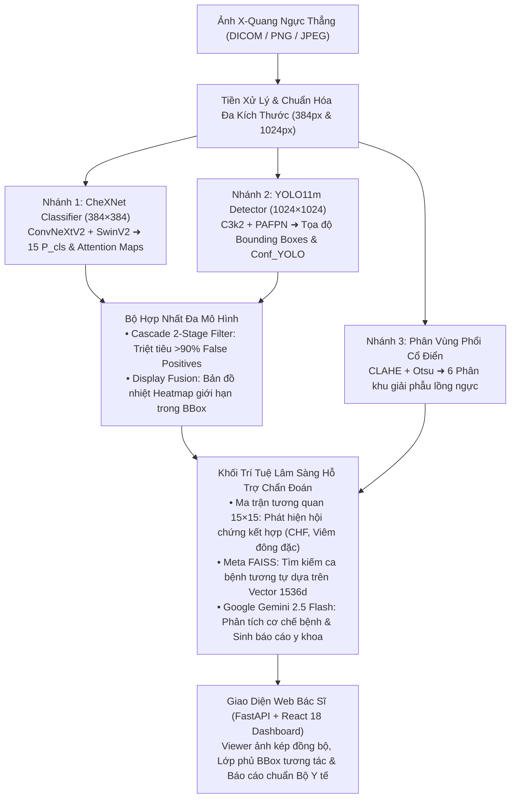
```mermaid
flowchart TB
    IN["Ảnh X-Quang Ngực Thẳng (DICOM / PNG / JPEG)"] --> PRE["Tiền Xử Lý & Chuẩn Hóa Đa Kích Thước (384px & 1024px)"]

    PRE --> CHEX["Nhánh 1: CheXNet Classifier (384×384)<br/>ConvNeXtV2 + SwinV2 ➜ 15 P_cls & Attention Maps"]
    PRE --> YOLO["Nhánh 2: YOLO11m Detector (1024×1024)<br/>C3k2 + PAFPN ➜ Tọa độ Bounding Boxes & Conf_YOLO"]
    PRE --> OTSU["Nhánh 3: Phân Vùng Phổi Cổ Điển<br/>CLAHE + Otsu ➜ 6 Phân khu giải phẫu lồng ngực"]

    CHEX --> FUSION["Bộ Hợp Nhất Đa Mô Hình<br/>• Cascade 2-Stage Filter: Triệt tiêu >90% False Positives<br/>• Display Fusion: Bản đồ nhiệt Heatmap giới hạn trong BBox"]
    YOLO --> FUSION

    FUSION --> CLINICAL["Khối Trí Tuệ Lâm Sàng Hỗ Trợ Chẩn Đoán<br/>• Ma trận tương quan 15×15: Phát hiện hội chứng kết hợp (CHF, Viêm đông đặc)<br/>• Meta FAISS: Tìm kiếm ca bệnh tương tự dựa trên Vector 1536d<br/>• Google Gemini 2.5 Flash: Phân tích cơ chế bệnh & Sinh báo cáo y khoa"]
    OTSU --> CLINICAL

    CLINICAL --> WEB["Giao Diện Web Bác Sĩ (FastAPI + React 18 Dashboard)<br/>Viewer ảnh kép đồng bộ, Lớp phủ BBox tương tác & Báo cáo chuẩn Bộ Y tế"]
```

---

### 2. Chi Tiết Cách Làm Việc Của Model Hybrid (ConvNeXtV2 + SwinV2)

Mô hình phân loại cốt lõi kết hợp sức mạnh bổ trợ lẫn nhau giữa **Mạng tích chập thế hệ mới (ConvNeXtV2)** và **Vision Transformer dạng cửa sổ trượt (SwinV2)**:

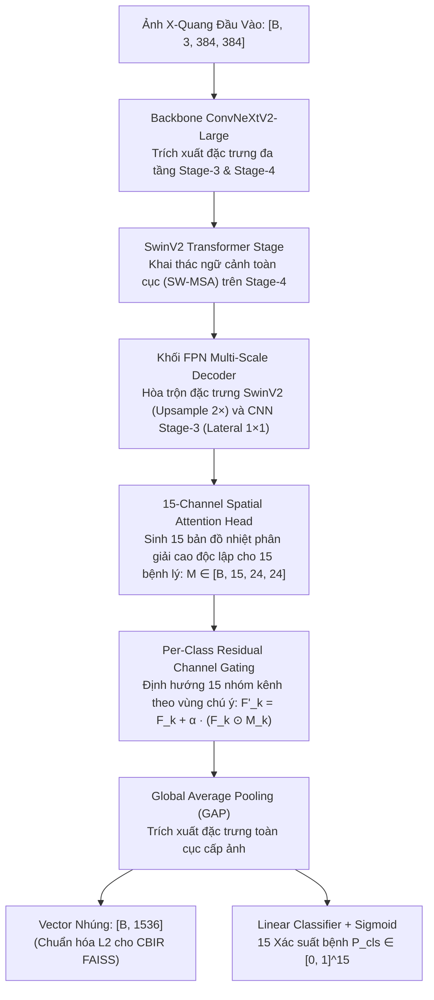
```mermaid
flowchart TB
    IMG["Ảnh X-Quang Đầu Vào: [B, 3, 384, 384]"] --> CNN["Backbone ConvNeXtV2-Large<br/>Trích xuất đặc trưng đa tầng Stage-3 & Stage-4"]

    CNN --> SWIN["SwinV2 Transformer Stage<br/>Khai thác ngữ cảnh toàn cục (SW-MSA) trên Stage-4"]

    SWIN --> FPN["Khối FPN Multi-Scale Decoder<br/>Hòa trộn đặc trưng SwinV2 (Upsample 2×) và CNN Stage-3 (Lateral 1×1)"]

    FPN --> ATT["15-Channel Spatial Attention Head<br/>Sinh 15 bản đồ nhiệt phân giải cao độc lập cho 15 bệnh lý: M ∈ [B, 15, 24, 24]"]

    ATT --> GATING["Per-Class Residual Channel Gating<br/>Định hướng 15 nhóm kênh theo vùng chú ý: F'_k = F_k + α · (F_k ⊙ M_k)"]

    GATING --> GAP["Global Average Pooling (GAP)<br/>Trích xuất đặc trưng toàn cục cấp ảnh"]

    GAP --> OUT_EMB["Vector Nhúng: [B, 1536]<br/>(Chuẩn hóa L2 cho CBIR FAISS)"]
    GAP --> OUT_CLS["Linear Classifier + Sigmoid<br/>15 Xác suất bệnh P_cls ∈ [0, 1]^15"]
```

#### A. Nhánh Trích Xuất Cục Bộ — ConvNeXtV2-Large
- **Vai trò**: Chuyên trách phát hiện các tín hiệu tổn thương dạng hình thái và kết cấu vi mô (Local Textures) như nốt mờ nhỏ, viền xơ hóa, mức khí - dịch màng phổi.
- **Cấu trúc khối**:
  - Tích chập sâu 7×7 Depthwise Convolution bắt trường tiếp nhận rộng.
  - Chuẩn hóa theo kênh ngược (Inverted Bottleneck ratio 4:1) kết hợp LayerNorm.
  - **Global Response Normalization (GRN)**: Tăng cường độ tương phản giữa các kênh đặc trưng, chống triệt tiêu tín hiệu qua nhiều lớp sâu.
- **Kích thước đặc trưng trích xuất**:
  - Stage-3: `F_CNN_stage3 ∈ R^[B × 1536 × 24 × 24]`
  - Stage-4: `F_CNN_stage4 ∈ R^[B × 1536 × 12 × 12]`

#### B. Nhánh Khai Thác Ngữ Cảnh Toàn Cục — SwinV2-Large
- **Vai trò**: Nắm bắt mối tương quan không gian tầm xa (Long-range Dependencies), tính đối xứng giải phẫu giữa hai phế trường và tương quan giữa kích thước bóng tim với vòm hoành.
- **Cơ chế**:
  - Cửa sổ tự chú ý dịch chuyển (Shifted Window Self-Attention - SW-MSA) với kích thước cửa sổ 12×12 → 24×24.
  - Post-LayerNorm và **Cosine Attention** giúp ổn định gradient khi truyền ngược ở quy mô tham số lớn (Large scale).
- **Kích thước đặc trưng đầu ra**:
  - `F_ViT ∈ R^[B × 1536 × 12 × 12]`

#### C. Khối Hòa Trộn Đa Tỷ Lệ (FPN Decoder)
Để tạo ra bản đồ nhiệt phân giải cao phục vụ khoanh vùng tổn thương, hệ thống hòa trộn đặc trưng ngữ cảnh từ ViT với đặc trưng không gian phân giải cao từ CNN Stage-3:

```text
F_FPN = GELU(BatchNorm(Conv3x3(Upsample2x(F_ViT) + Conv1x1(F_CNN_stage3)))) ∈ R^[B × 256 × 24 × 24]
```

#### D. Đầu Tạo Bản Đồ Chú Ý 15 Kênh Độc Lập (15-Channel Attention Head)
Thay vì sử dụng chung 1 bản đồ nhiệt duy nhất cho mọi bệnh, hệ thống áp dụng Segmentation Head riêng biệt để sinh ra **15 bản đồ nhiệt độc lập** cho 15 bệnh lý:

```text
M = Sigmoid(Conv1x1(GELU(BatchNorm(Conv3x3(F_FPN))))) ∈ [0, 1]^[B × 15 × 24 × 24]
```

Mỗi kênh `k ∈ {0, ..., 14}` đại diện cho vùng chú ý chuyên biệt của bệnh lý thứ `k` (ví dụ: kênh *Cardiomegaly* chỉ khoanh vùng diện tích tim, kênh *Effusion* khoanh vùng góc sườn hoành).

#### E. Cơ Chế Gated Residual Attention Theo Nhóm Kênh (Per-Class Channel Gating)
Để luồng thông tin không gian từ bản đồ chú ý trực tiếp tái định hướng bộ phân loại, vector kênh của CNN Stage-4 (1536 kênh) được chia thành 15 nhóm tương ứng với 15 kênh chú ý:

```text
F'_k = F_k + α · (F_k ⊙ M_k),   với k ∈ {0, ..., 14}
```

Trong đó:
- `F_k` là nhóm kênh đặc trưng thứ `k` (14 nhóm đầu gồm 102 kênh, nhóm cuối gồm 108 kênh).
- `M_k` là bản đồ chú ý thứ `k` sau khi nội suy song tuyến tính về kích thước Stage-4 `[B, 1, 12, 12]`.
- `α = Sigmoid(θ_gate) × α_max ∈ [0, 0.8]` là hệ số cổng thích nghi học được. Giới hạn trần `α_max = 0.8` triệt tiêu hoàn toàn nguy cơ sụp đổ bản đồ chú ý (Attention Collapse), buộc bộ phân loại phải tập trung đúng thực thể tổn thương.

#### F. Đầu Phân Loại & Vector Nhúng (Classification & Embedding)
Đặc trưng sau cổng gating được gộp qua tầng gộp trung bình toàn cục (GAP):

```text
z_emb = GAP(F') ∈ R^[B × 1536]
y_logits = W_cls · z_emb + b ∈ R^[B × 15]   ==>   P_cls = Sigmoid(y_logits)
```

- `z_emb` được chuẩn hóa L2 để làm vector biểu diễn ảnh cho module truy vấn ca tương tự (CBIR).

---

### 3. Chi Tiết Cách Làm Việc Của Model YOLO (YOLO11m Lesion Detector)

Nhánh định vị chạy song song mô hình **YOLO11m** (Ultralytics) được thiết kế chuyên biệt cho ảnh y tế độ phân giải cao:

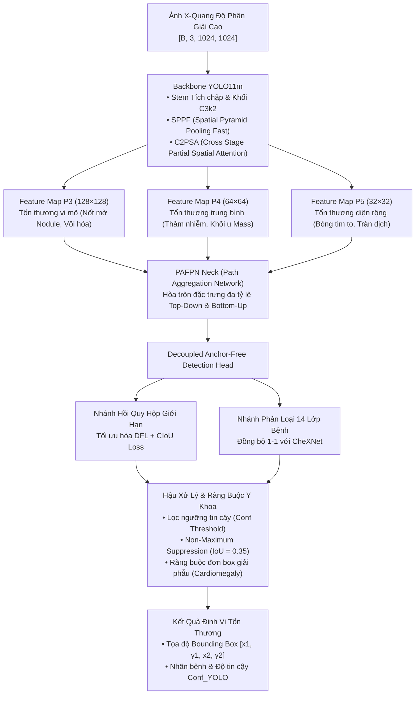
```mermaid
flowchart TB
    IN_DET["Ảnh X-Quang Độ Phân Giải Cao<br/>[B, 3, 1024, 1024]"] --> BB["Backbone YOLO11m<br/>• Stem Tích chập & Khối C3k2<br/>• SPPF (Spatial Pyramid Pooling Fast)<br/>• C2PSA (Cross Stage Partial Spatial Attention)"]

    BB --> P3["Feature Map P3 (128×128)<br/>Tổn thương vi mô (Nốt mờ Nodule, Vôi hóa)"]
    BB --> P4["Feature Map P4 (64×64)<br/>Tổn thương trung bình (Thâm nhiễm, Khối u Mass)"]
    BB --> P5["Feature Map P5 (32×32)<br/>Tổn thương diện rộng (Bóng tim to, Tràn dịch)"]

    P3 & P4 & P5 --> NECK["PAFPN Neck (Path Aggregation Network)<br/>Hòa trộn đặc trưng đa tỷ lệ Top-Down & Bottom-Up"]

    NECK --> HEAD["Decoupled Anchor-Free Detection Head"]

    HEAD --> BOX_BRANCH["Nhánh Hồi Quy Hộp Giới Hạn<br/>Tối ưu hóa DFL + CIoU Loss"]
    HEAD --> CLS_BRANCH["Nhánh Phân Loại 14 Lớp Bệnh<br/>Đồng bộ 1-1 với CheXNet"]

    BOX_BRANCH & CLS_BRANCH --> FILTER["Hậu Xử Lý & Ràng Buộc Y Khoa<br/>• Lọc ngưỡng tin cậy (Conf Threshold)<br/>• Non-Maximum Suppression (IoU = 0.35)<br/>• Ràng buộc đơn box giải phẫu (Cardiomegaly)"]

    FILTER --> OUT_BOX["Kết Quả Định Vị Tổn Thương<br/>• Tọa độ Bounding Box [x1, y1, x2, y2]<br/>• Nhãn bệnh & Độ tin cậy Conf_YOLO"]
```
- **Kích thước đầu vào**: 1024 × 1024 pixels, bảo toàn tối đa vi cấu trúc nốt mờ (≤ 3mm) và dải màng phổi mỏng.
- **Quy mô tham số**: 20.1M tham số (20.1 × 10⁶), cân bằng hoàn hảo giữa tốc độ suy luận thời gian thực và khả năng định vị tổn thương nhỏ.
- **Kiến trúc khối cải tiến**:
  - **C3k2 Module**: Khối tích chập phân tán tối ưu hóa luồng gradient sâu.
  - **C2PSA (Cross Stage Partial with Pointwise Spatial Attention)**: Bổ sung cơ chế tự chú ý điểm ảnh trong cổ mạng (Neck), giúp khoanh chính xác viền bờ tổn thương mờ nhạt.
  - **SPPF (Spatial Pyramid Pooling - Fast)**: Tích hợp ngữ cảnh đa thang đo với độ trễ tối thiểu.
  - **Decoupled Head**: Tách riêng hoàn toàn nhánh tính hồi quy tọa độ hộp giới hạn (DFL + CIoU Loss) và nhánh phân loại nhãn.
- **Đồng bộ nhãn**: 14 lớp bệnh lý giải phẫu đồng bộ hoàn toàn 1:1 với CheXNet (trừ *No Finding*).

---

### 4. Cơ Chế Hợp Nhất Đa Mô Hình (Cascade & Display Fusion)

```text
┌───────────────────────────┐      ┌───────────────────────────┐
│     CheXNet Classifier    │      │      YOLO11m Detector     │
│   P_cls (Toàn cục 384px)  │      │  Conf_YOLO (Cục bộ 1024px) │
└─────────────┬─────────────┘      └─────────────┬─────────────┘
              │                                  │
              └───────────────┬──────────────────┘
                              ▼
             ┌───────────────────────────────────┐
             │       Cascade 2-Stage Filter      │
             │   Score_Cascade = P_cls × Conf_YOLO│
             └─────────────────┬─────────────────┘
                               ▼
        ┌───────────────────────────────────────────┐
        │        Display Fusion Visualizer          │
        │   ┌───────────────────────────────────┐   │
        │   │  Có Box YOLO:                     │   │
        │   │  Heatmap ⊂ Bounding Box           │   │
        │   │  Viền xanh liền nét (Độ tin cậy)  │   │
        │   ├───────────────────────────────────┤   │
        │   │  Không có Box YOLO:               │   │
        │   │  Heatmap toàn cảnh + Khung Otsu   │   │
        │   │  Viền cam nét đứt (Tham khảo)     │   │
        │   └───────────────────────────────────┘   │
        └───────────────────────────────────────────┘
```

#### A. Bộ Lọc Phân Tầng Cascade 2-Stage
Các mô hình phân loại toàn cục thường dễ mắc lỗi dương tính giả (False Positives) do các bóng mờ sinh lý hoặc thiết bị y tế (dây đo, máy tạo nhịp). Ngược lại, detector cục bộ dễ bị nhiễu nền nếu không có ngữ cảnh tổng quát. Hệ thống áp dụng công thức xác suất liên hợp:

```text
Score_Cascade(c) = P_CheXNet(c) × Conf_YOLO(c)
```

Hệ thống thiết lập các ngưỡng phân tầng theo mức độ ưu tiên lâm sàng:
- **Nguy kịch (Critical)** (*Pneumothorax, Pneumonia*): Ngưỡng cắt **0.05** → Tối đa hóa Recall nhằm không bỏ sót ca cấp cứu đe dọa tính mạng.
- **Nguy cơ cao (High)** (*Cardiomegaly, Effusion*): Ngưỡng cắt **0.10**.
- **Đông đặc (Consolidation)**: Ngưỡng cắt **0.12**.
- **Mặc định**: Ngưỡng cắt **0.15**.

#### B. Cơ Chế Trực Quan Hóa Display Fusion
Một vấn đề lớn trong các hệ thống CADx truyền thống là sự xung đột thị giác giữa Attention Heatmap (thường lan tỏa rộng) và Bounding Box (khu trú gọn). **Display Fusion** chuẩn hóa trải nghiệm:
- **Khi YOLO phát hiện Bounding Box (B)**:
  Heatmap chú ý được cắt khớp theo phạm vi hình học của Bounding Box, triệt tiêu tín hiệu lan tỏa ngoài vùng tổn thương:
  ```text
  Heatmap_display(x, y) = M_k(x, y) nếu (x, y) thuộc Bounding Box, ngược lại = 0
  ```
  Vẽ khung viền xanh lá đậm nét (High-Confidence Boundary) kèm nhãn bệnh lý và điểm Cascade.
- **Khi YOLO không tìm thấy Bounding Box**: Hệ thống chuyển sang chế độ dự phòng (Fallback), phủ Heatmap toàn ảnh và tự động áp dụng phân ngưỡng thích nghi Otsu để tạo khung đứt nét màu cam (Advisory Reference Boundary).

---

### 5. Khối Trí Tuệ Lâm Sàng & Phân Tích Chuyên Sâu

#### A. Phân Vùng Phổi Giải Phẫu (Classical Lung Segmentation)
- **Phương pháp**: Sử dụng thuật toán xử lý ảnh hình thái học thuần túy (không phụ thuộc trọng số nặng, tốc độ xử lý < 15ms):
  1. Cân bằng lược đồ độ xám cục bộ thích nghi **CLAHE** (Clip Limit 2.0, Grid 8×8) làm nổi bật độ tương phản phế trường.
  2. Khử nhiễu qua bộ lọc Gaussian Blur (5×5).
  3. Phân ngưỡng nhị phân nghịch đảo Otsu (Otsu's Inverse Thresholding).
  4. Phép đóng/mở hình thái học (Morphological Closing/Opening) lấp đầy các mạch máu phổi.
  5. Lọc lấy 2 vùng biên bao (Contour) lớn nhất đại diện cho phế trường phổi trái và phải.
- **Xác định 6 phân khu giải phẫu**: Đỉnh phổi (Apical), Thùy trên (Upper), Thùy giữa/rốn phổi (Hilar/Middle), Thùy dưới (Lower), và Góc sườn hoành hai bên (Costophrenic Angles).

#### B. Ma Trận Tương Quan Đồng Xuất Hiện Bệnh Lý 15×15 (Co-occurrence Correlation)
Được trích xuất từ phân tích thống kê trên **107,880 ảnh X-quang thực tế** theo hệ số tương quan Pearson (r ∈ [-1, 1]). Hệ thống tự động nhận diện các tổ hợp hội chứng lâm sàng đa bệnh lý:
- **Cardiomegaly + Effusion** → Gợi ý **Hội chứng suy tim sung huyết (CHF)**.
- **Pneumonia + Consolidation** → Gợi ý **Viêm phổi thùy đông đặc cấp tính**.
- **Mass + Atelectasis** → Cảnh báo **Khối u phế quản chèn ép gây xẹp phổi**.
- **Fibrosis + Pleural Thickening** → Gợi ý **Tổn thương di chứng màng phổi - xơ hóa mạn tính**.

#### C. Hệ Thống Tra Cứu Ca Tương Tự CBIR (Dynamic Incremental Indexing)
- **Vector biểu diễn**: Vector 1536 chiều trích xuất từ tầng GAP của mô hình hybrid, được chuẩn hóa L2.
- **Cơ sở dữ liệu vector**: Sử dụng **Meta FAISS** với cấu trúc chỉ mục `IndexFlatIP` (Cosine Similarity trên vector chuẩn hóa):

```text
S(u, v) = ∑(u_i · v_i)   (với i = 1 đến 1536)
```

- **Cơ chế Dynamic Growth**: Bác sĩ có thể bấm nút **"Lưu ca bệnh tham chiếu"** trực tiếp trên giao diện web. Hệ thống tự động nạp vector đặc trưng của ảnh mới cùng kết luận xác thực vào cơ sở dữ liệu vector tức thời mà **không cần khởi động lại server hoặc tái huấn luyện**.

#### D. Tự Động Sinh Báo Cáo Lâm Sàng & Trợ Lý Gemini 2.5 Flash
- Bộ sinh báo cáo Tiếng Việt tự động ghép nối các chỉ số phát hiện, tọa độ giải phẫu và kết luận hội chứng thành biên bản chẩn đoán chuẩn Bộ Y tế.
- Tích hợp **Google Gemini 2.5 Flash API** đóng vai trò trợ lý chuyên khoa: Phân tích cơ chế sinh lý bệnh, cảnh báo biến chứng cấp cứu và đề xuất phác đồ cận lâm sàng tiếp theo (Chụp cắt lớp vi tính CT-Scan độ phân giải cao HRCT, siêu âm màng phổi, khí máu động mạch).

---

### 6. Chi Tiết Cách Vận Hành Của Hệ Thống Web (Full-Stack Serving)

Hệ thống phục vụ người dùng kết hợp giữa giao diện Web React 18 hiện đại và máy chủ FastAPI bất đồng bộ hiệu năng cao:

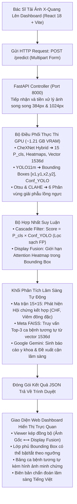
```mermaid
flowchart TB
    UI_INPUT["Bác Sĩ Tải Ảnh X-Quang Lên Dashboard (React 18 + Vite)"] --> HTTP_REQ["Gửi HTTP Request: POST /predict (Multipart Form)"]

    HTTP_REQ --> FASTAPI["FastAPI Controller (Port 8000)<br/>Tiếp nhận và tiền xử lý ảnh song song 384px & 1024px"]

    FASTAPI --> GPU_EXEC["Bộ Điều Phối Thực Thi GPU (~1.21 GB VRAM)<br/>• CheXNet Hybrid ➜ 15 P_cls, Heatmaps, Vector 1536d<br/>• YOLO11m ➜ Bounding Boxes [x1,y1,x2,y2], Conf_YOLO<br/>• Otsu & CLAHE ➜ 6 Phân vùng giải phẫu lồng ngực"]

    GPU_EXEC --> FUSION_CORE["Bộ Hợp Nhất Suy Luận<br/>• Cascade Filter: Score = P_cls × Conf_YOLO (Lọc sạch FP)<br/>• Display Fusion: Giới hạn Attention Heatmap trong Bounding Box"]

    FUSION_CORE --> CLINICAL_CORE["Khối Phân Tích Lâm Sàng Tự Động<br/>• Ma trận 15×15: Phát hiện Hội chứng kết hợp (CHF, Viêm đông đặc)<br/>• Meta FAISS: Truy vấn Top-3 ca bệnh tương tự từ vector 1536d<br/>• Google Gemini: Sinh báo cáo y khoa & Đề xuất cận lâm sàng"]

    CLINICAL_CORE --> JSON_OUT["Đóng Gói Kết Quả JSON Trả Về Trình Duyệt"]

    JSON_OUT --> UI_VIEW["Giao Diện Web Dashboard Hiển Thị Trực Quan<br/>• Viewer kép đồng bộ (Ảnh Gốc ⟷ Display Fusion)<br/>• Lớp phủ Bounding Box có thể bật/tắt theo ngưỡng<br/>• Bảng ca bệnh tương tự kèm hình ảnh minh chứng<br/>• Biên bản chẩn đoán lâm sàng Tiếng Việt"]
```

---

### 7. Luồng Hoạt Động Quá Trình Huấn Luyện (Training Pipelines)

#### A. Quá Trình Huấn Luyện Model Hybrid

Quy trình huấn luyện mạng phân loại cốt lõi CheXNet Hybrid (ConvNeXtV2 + SwinV2) trên tập dữ liệu NIH ChestX-ray 14:


```mermaid
flowchart TB
    NIH_DS["Tập Dữ Liệu NIH ChestX-ray 14 (112,120 ảnh, 15 nhãn)"] --> DATA_SPLIT["Phân Chia Tập Cấp Bệnh Nhân (Patient-level Split)<br/>Train (70%) • Val (10%) • Test (20%)"]

    DATA_SPLIT --> AUG_PIPE["Data Augmentation & Tiền Xử Lý<br/>Random Flip, Xoay ±10°, CLAHE, Resize 384×384 & Normalization"]

    AUG_PIPE --> MODEL_BUILD["Khởi Tạo Kiến Trúc CheXNet Hybrid<br/>• Backbone ConvNeXtV2 & SwinV2 (Pretrained ImageNet-22k)<br/>• Khởi tạo FPN Decoder, 15-Channel Attention Head & Gating α"]

    MODEL_BUILD --> TRAIN_FORWARD["Lan Truyền Tiến (Forward Pass)<br/>Tự động bật Mixed Precision (AMP fp16) & Gradient Checkpointing"]

    TRAIN_FORWARD --> LOSS_EVAL["Tính Toán Hàm Mất Mát Đa Mục Tiêu<br/>• Loss Phân Loại: Weighted Multi-label BCE / Asymmetric Loss<br/>• Loss Chú Ý: Regularization Loss chống sụp đổ bản đồ nhiệt<br/>➜ Loss_Total = Loss_cls + λ · Loss_att"]

    LOSS_EVAL --> OPTIM_BACKWARD["Lan Truyền Ngược & Cập Nhật Trọng Số<br/>• GradScaler chống hiện tượng Underflow FP16<br/>• Optimizer: AdamW (Weight Decay 1e-2)<br/>• Scheduler: Cosine Annealing Learning Rate"]

    OPTIM_BACKWARD --> VAL_CHECK["Đánh Giá Sau Mỗi Epoch trên Tập Validation<br/>• Tính Mean AUROC & PR-AUC trên toàn bộ 15 lớp bệnh<br/>• Xác định ngưỡng phân lớp tối ưu Thr* theo chỉ số Youden's J"]

    VAL_CHECK --> SAVE_MODEL["Lưu Trọng Số Xuất Sắc Nhất (Early Stopping)<br/>➜ Lưu file trọng số: hybrid_model.pth"]
```

#### B. Quá Trình Huấn Luyện Model YOLO11m

Quy trình huấn luyện mạng định vị tổn thương YOLO11m kết hợp dữ liệu VinDr-CXR và nhãn giả chưng cất tri thức (Knowledge Distillation) từ CheXNet Model:

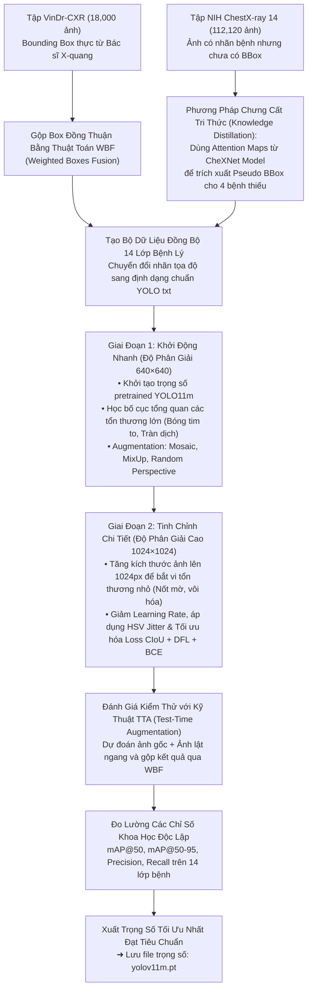
```mermaid
flowchart TB
    DS_VINDR["Tập VinDr-CXR (18,000 ảnh)<br/>Bounding Box thực từ Bác sĩ X-quang"] --> WBF_STEP["Gộp Box Đồng Thuận Bằng Thuật Toán WBF<br/>(Weighted Boxes Fusion)"]
    
    DS_NIH["Tập NIH ChestX-ray 14 (112,120 ảnh)<br/>Ảnh có nhãn bệnh nhưng chưa có BBox"] --> DISTILL_STEP["Phương Pháp Chưng Cất Tri Thức (Knowledge Distillation):<br/>Dùng Attention Maps từ CheXNet Model<br/>để trích xuất Pseudo BBox cho 4 bệnh thiếu"]

    WBF_STEP --> UNIFIED_DATA["Tạo Bộ Dữ Liệu Đồng Bộ 14 Lớp Bệnh Lý<br/>Chuyển đổi nhãn tọa độ sang định dạng chuẩn YOLO txt"]
    DISTILL_STEP --> UNIFIED_DATA

    UNIFIED_DATA --> PROG_P1["Giai Đoạn 1: Khởi Động Nhanh (Độ Phân Giải 640×640)<br/>• Khởi tạo trọng số pretrained YOLO11m<br/>• Học bố cục tổng quan các tổn thương lớn (Bóng tim to, Tràn dịch)<br/>• Augmentation: Mosaic, MixUp, Random Perspective"]

    PROG_P1 --> PROG_P2["Giai Đoạn 2: Tinh Chỉnh Chi Tiết (Độ Phân Giải Cao 1024×1024)<br/>• Tăng kích thước ảnh lên 1024px để bắt vi tổn thương nhỏ (Nốt mờ, vôi hóa)<br/>• Giảm Learning Rate, áp dụng HSV Jitter & Tối ưu hóa Loss CIoU + DFL + BCE"]

    PROG_P2 --> TTA_TEST["Đánh Giá Kiểm Thử với Kỹ Thuật TTA (Test-Time Augmentation)<br/>Dự đoán ảnh gốc + Ảnh lật ngang và gộp kết quả qua WBF"]

    TTA_TEST --> METRIC_CHECK["Đo Lường Các Chỉ Số Khoa Học Độc Lập<br/>mAP@50, mAP@50-95, Precision, Recall trên 14 lớp bệnh"]

    METRIC_CHECK --> EXPORT_WEIGHTS["Xuất Trọng Số Tối Ưu Nhất Đạt Tiêu Chuẩn<br/>➜ Lưu file trọng số: yolov11m.pt"]
```

---

## 💻 Công Nghệ Sử Dụng Trong Dự Án

Dự án CheXNet Pro AI được xây dựng dựa trên ngăn xếp công nghệ (Technology Stack) hiện đại, chuyên sâu và tối ưu hóa cao cho bài toán Y tế Thông minh:

| Lĩnh Vực | Công Nghệ / Thư Viện | Phiên Bản | Vai Trò & Chức Năng Cốt Lõi |
|:---|:---|:---:|:---|
| **Deep Learning Core** | **PyTorch** | `2.0+` | Nền tảng tính toán Tensor, Autograd Engine, hỗ trợ CUDA, TorchScript và AMP. |
| | **Torchvision** | `0.15+` | Tiền xử lý, biến đổi tăng cường dữ liệu ảnh y tế (Augmentations, Normalization). |
| | **timm** (PyTorch Image Models) | `0.9+` | Cung cấp backbone kiến trúc ConvNeXtV2-Large và SwinV2-Large chất lượng cao. |
| **Object Detection** | **Ultralytics YOLO11** | `11.x` | Mô hình phát hiện tổn thương YOLO11m (20.1M params) với C3k2 và C2PSA Attention. |
| **Xử Lý Ảnh Y Tế** | **OpenCV (cv2)** | `4.8+` | Xử lý ảnh số: Thuật toán CLAHE, Gaussian Blur, nhị phân Otsu, phân vùng phế trường. |
| | **Pillow (PIL)** | `10.0+` | Đọc, giải mã, chuyển đổi kênh màu RGB và ghi ảnh phân giải cao. |
| **Khoa Học Dữ Liệu & Đo Lường** | **NumPy & Pandas** | `1.24+ / 2.0+` | Thao tác ma trận, tính ma trận đồng xuất hiện Pearson và xử lý bảng dữ liệu nhãn bệnh. |
| | **scikit-learn & SciPy** | `1.3+` | Tính toán chỉ số khoa học: ROC-AUC đa nhãn, PR-AUC, Youden's J Index, Bootstrap CI 95%. |
| | **Matplotlib & Seaborn** | `3.7+ / 0.12+` | Vẽ biểu đồ ROC, Precision-Recall curves, ma trận nhầm lẫn và trực quan hóa Display Fusion. |
| **Vector Search & CBIR** | **Meta FAISS** | `1.7+` | Cơ sở dữ liệu tìm kiếm vector tương đồng (IndexFlatIP), độ trễ truy vấn sub-millisecond. |
| **Backend & Serving API** | **FastAPI** | `0.100+` | Khung ứng dụng Web API bất đồng bộ (Asynchronous ASGI), tự động sinh OpenAPI Docs. |
| | **Uvicorn** | `0.23+` | Máy chủ Web ASGI hiệu năng cực cao phục vụ luồng suy luận đồng thời. |
| | **Pydantic** | `2.0+` | Xác thực dữ liệu đầu vào và tuần tự hóa Schema phản hồi y khoa nghiêm ngặt. |
| | **Python-Multipart** | `0.0.6+` | Xử lý tải lên tệp ảnh X-quang dung lượng lớn qua giao thức HTTP POST. |
| **Frontend Web Dashboard** | **React** | `18.2+` | Thư viện UI xây dựng giao diện Cyber-Medical SPA tương tác thời gian thực. |
| | **Vite** | `5.2+` | Trình đóng gói hiện đại, Hot Module Replacement (HMR) và tối ưu build production. |
| | **Tailwind CSS** | `4.0+` | Thiết kế hệ thống giao diện y tế tối màu (Dark Medical Theme) chuẩn xác, Responsive. |
| | **Lucide React** | `0.344+` | Bộ biểu tượng đồ họa chuyên nghiệp cho các tính năng y tế và thao tác chẩn đoán. |
| **Generative AI & LLM** | **Google Gemini 2.5 Flash** | `v1beta / REST` | Trợ lý trí tuệ nhân tạo sinh phân tích cơ chế bệnh học và đề xuất cận lâm sàng chuyên sâu. |
| **Tối Ưu Hóa Bộ Nhớ** | **CPU-Staged Model Loading** | Kỹ thuật nội bộ | Phân tầng nạp mô hình qua CPU RAM trước khi lên GPU, đưa tổng VRAM về mức **1.21 GB**. |
| | **NVIDIA CUDA & cuDNN** | `11.8 / 12.x` | Tăng tốc tính toán phần cứng trên lõi CUDA và Tensor Cores của GPU NVIDIA. |

---

## 📂 Cấu Trúc Thư Mục Dự Án

Mọi đường dẫn trong dự án đều được thiết lập chuẩn hóa, tính động từ thư mục gốc `CheXNet`:

```text
CheXNet/
├── main.py                          # CLI tương tác: Huấn luyện / Resume / Đánh giá kiểm thử
├── predict_single.py                # Module suy luận ảnh đơn + sinh Heatmap chú ý
├── run_predict.py                   # Script demo suy luận ĐA MÔ HÌNH (CheXNet + YOLO11m) kèm BBox
├── requirements.txt                 # Danh sách gói thư viện phụ thuộc
├── README.md                        # Tài liệu hướng dẫn dự án
│
├── Models/                          # ═══ Lõi Kiến Trúc Mô Hình AI ═══
│   ├── Model.py                     # HybridCNNViTModel (ConvNeXtV2 + SwinV2 + FPN + Gating)
│   ├── TrainModel.py                # Pipeline huấn luyện 2 giai đoạn (ASL, Dice, EMA, DDP)
│   ├── read_data.py                 # DatasetGenerator, HybridBatchSampler (NIH:VinDr = 3:1)
│   ├── config.py                    # TensorCoreConfig (Tự động nhận diện GPU & cấu hình AMP)
│   ├── head_map.py                  # Module trích xuất và hiển thị 15 Attention Maps
│   ├── checkpoint_utils.py          # Tiện ích nạp checkpoint an toàn (load_checkpoint_safe)
│   └── visualize.py                 # Đồ thị tiến trình huấn luyện (Loss, Dice, AUROC)
│
├── Backend/                         # ═══ Dịch Vụ API Phục Vụ (FastAPI) ═══
│   ├── main.py                      # FastAPI App: Endpoint /predict, /api/add_reference_case
│   ├── yolo_detector.py             # Quản lý YOLO11m, Cascade filter, tỷ lệ tọa độ BBox
│   ├── lung_segmentation.py         # Phân vùng trường phổi, xác định vị trí giải phẫu
│   ├── post_processing.py           # CAM-to-BBoxes, ma trận đồng xuất hiện 15x15
│   ├── report_generator.py          # Tự động lập báo cáo lâm sàng Tiếng Việt chuẩn y khoa
│   ├── cbir.py                      # Tra cứu ca tương tự qua vector FAISS, Dynamic Growth
│   ├── requirements.txt             # Thư viện cho Backend server
│   ├── data/                        # Thư mục cơ sở dữ liệu vector FAISS (chứa .gitkeep)
│   └── scripts/
│       └── build_faiss_index.py     # Script tạo sẵn cơ sở dữ liệu FAISS từ tập ảnh
│
├── Frontend/                        # ═══ Giao Diện Web Người Dùng (React 18 + Vite) ═══
│   ├── src/
│   │   ├── App.jsx                  # Màn hình Dashboard Cyber-Medical, viewer kép
│   │   ├── components/ClinicalReport.jsx # Khung hiển thị báo cáo & nút lưu ca bệnh mới
│   │   ├── services/geminiService.js     # Tích hợp Gemini 2.5 Flash phân tích lâm sàng
│   │   └── utils/radiologyMapper.js      # Ánh xạ thuật ngữ bệnh học X-quang chuẩn
│   ├── package.json
│   └── vite.config.js
│
├── Trainedmodel/                    # ═══ Trọng Số Mô Hình Đã Huấn Luyện ═══
│   ├── hybrid_model.pth             # Model chính: ConvNeXtV2-Large + SwinV2-Large (2.23 GB)
│   ├── yolov11m.pt                  # Model phát hiện tổn thương YOLO11m (161 MB)
│   └── .gitkeep
│
├── Dataset/                         # Danh mục phân chia dữ liệu train/val/test CSV
│   ├── train_list.csv
│   ├── val_list.csv
│   └── test_list.csv
│
├── Database/                        # Thư mục lưu trữ ảnh X-quang gốc (chứa .gitkeep)
│   └── .gitkeep
│
├── Notebooks/                       # Jupyter Notebooks huấn luyện và nghiên cứu
│   ├── yolov11m_fixed.ipynb         # Notebook huấn luyện YOLO11m với WBF & Progressive Training
│   └── yolov11m_colab.ipynb         # Notebook chạy trên môi trường Google Colab
│
└── Results/                         # ═══ Kết Quả Thực Nghiệm & Ảnh Đánh Giá ═══
    ├── EX/                          # Ảnh mẫu thực nghiệm & kết quả demo Display Fusion
    │   ├── Cardiomegally.png        # Ảnh bệnh nhân mẫu bị phì đại tim
    │   ├── Cardiomegally_bbox.png   # Ảnh full-size gốc có Bounding Box YOLO11m
    │   ├── Cardiomegally_fusion.png # Ảnh full-size gốc lồng ghép Display Fusion (Heatmap ⊂ BBox)
    │   └── Cardiomegally_predict.png # Bảng tổng hợp kết quả dự đoán 3 khung hình
    ├── Hybrid/                      # Báo cáo đánh giá trên tập Test kết hợp (NIH + VinDr-CXR)
    └── NIH/                         # Báo cáo đánh giá trên tập Test chuẩn NIH Chest X-ray
```

---

## 🔬 Đột Phá Kỹ Thuật & Tối Ưu Hóa Bộ Nhớ

### 1. Giải Pháp Display Fusion — Chấm Dứt Xung Đột Heatmap vs BBox
Trước đây, bác sĩ thường bị bối rối khi Attention Heatmap của bộ phân loại chỉ vào một vùng, trong khi Bounding Box của detector lại chỉ vào vùng khác. **Display Fusion** giải quyết bài toán này:
- Nếu YOLO phát hiện tổn thương: Heatmap **chỉ được vẽ bên trong Bounding Box**, viền xanh lá liền nét (Độ tin cậy cao).
- Nếu không có box YOLO: Heatmap vẽ toàn ảnh kèm viền đứt nét cam từ thuật toán Otsu (Độ tin cậy tham khảo).

### 2. Tối Ưu Hóa VRAM GPU (Từ 3.7 GB Giảm Xuống 1.21 GB)
- **Vấn đề cũ**: Khi nạp trực tiếp checkpoint 2.23 GB lên GPU bằng `torch.load(..., map_location='cuda')` rồi mới khởi tạo `model.to('cuda')`, bộ nhớ VRAM bị nhân đôi lên mức **3.7 GB**, dễ gây tràn bộ nhớ trên card đồ họa phổ thông.
- **Giải pháp**: 
  1. Checkpoint được nạp vào RAM CPU qua `load_checkpoint_safe(..., device='cpu')`.
  2. Nạp `state_dict` vào mô hình trên CPU.
  3. Xóa đối tượng checkpoint và giải phóng bộ nhớ (`del ckpt, state_dict`, `gc.collect()`).
  4. Chỉ chuyển thực thể mô hình sạch duy nhất lên GPU (`model.to(device)`).
- **Kết quả**: VRAM cho CheXNet giảm xuống chỉ còn **1.12 GB**, cộng với YOLO11m (0.09 GB), tổng VRAM của cả 2 mô hình chạy song song là **1.21 GB**.

---

## 📊 Báo Cáo Đánh Giá Thực Nghiệm (Results Report)

Hiệu năng của mô hình được đánh giá độc lập trên **2 bộ kiểm thử quy mô lớn** với đầy đủ các thước đo chuẩn bài báo khoa học: **AUROC**, **PR-AUC**, **Ngưỡng tối ưu (Thr*) theo chỉ số Youden's J**, **F1-Score**, và **Bootstrap 95% Confidence Interval**.

---

### 1. Đánh giá trên tập dữ liệu NIH Chest X-ray (Mean AUROC: 0.8895)

Tập kiểm thử chuẩn NIH gồm hơn 25,000 ảnh X-quang lồng ngực với phân phối nhãn tự nhiên.

#### Bảng thông số chi tiết từng bệnh lý:

| STT | Bệnh lý | AUROC | PR-AUC | Ngưỡng tối ưu (Thr*) | F1 @ 0.5 | F1 @ Thr* |
|:---:|:---|:---:|:---:|:---:|:---:|:---:|
| 1 | **No Finding** | 0.8348 | 0.8460 | 0.793 | 0.7082 | **0.7714** |
| 2 | **Atelectasis** (Xẹp phổi) | 0.8733 | 0.4907 | 0.608 | 0.3378 | **0.4536** |
| 3 | **Cardiomegaly** (Phì đại tim) | **0.9446** | 0.4365 | 0.469 | 0.3083 | 0.2637 |
| 4 | **Effusion** (Tràn dịch màng phổi) | 0.9125 | 0.6325 | 0.619 | 0.4226 | **0.5555** |
| 5 | **Infiltration** (Thâm nhiễm) | 0.7479 | 0.4127 | 0.651 | 0.3465 | **0.4487** |
| 6 | **Mass** (Khối u) | 0.9187 | 0.5311 | 0.527 | 0.3329 | **0.3805** |
| 7 | **Nodule** (Nốt mờ) | 0.8708 | 0.4067 | 0.544 | 0.2618 | **0.3407** |
| 8 | **Pneumonia** (Viêm phổi) | 0.8249 | 0.1176 | 0.415 | 0.1425 | 0.0688 |
| 9 | **Pneumothorax** (Tràn khí màng phổi) | 0.9360 | 0.5829 | 0.539 | 0.3791 | **0.4440** |
| 10 | **Consolidation** (Đông đặc) | 0.8574 | 0.2513 | 0.492 | 0.2121 | 0.2062 |
| 11 | **Edema** (Phù phổi) | 0.9284 | 0.2570 | 0.446 | 0.1986 | 0.1564 |
| 12 | **Emphysema** (Khí phế thũng) | **0.9628** | 0.5388 | 0.457 | 0.3928 | 0.3208 |
| 13 | **Fibrosis** (Xơ hóa phổi) | 0.8879 | 0.2462 | 0.407 | 0.2141 | 0.1053 |
| 14 | **Pleural Thickening** (Dày màng phổi) | 0.8546 | 0.2607 | 0.465 | 0.2238 | 0.1818 |
| 15 | **Hernia** (Thoát vị hoành) | **0.9877** | 0.6661 | 0.271 | 0.6591 | 0.0610 |
| **—** | **Trung bình (Mean)** | **0.8895** | **0.4451** | **—** | **—** | **—** |

#### Các biểu đồ trực quan hóa kết quả kiểm thử trên NIH:

| Bảng Tổng Hợp Chỉ Số | Phân Phối AUROC Theo Từng Bệnh Lý |
|:---:|:---:|
| 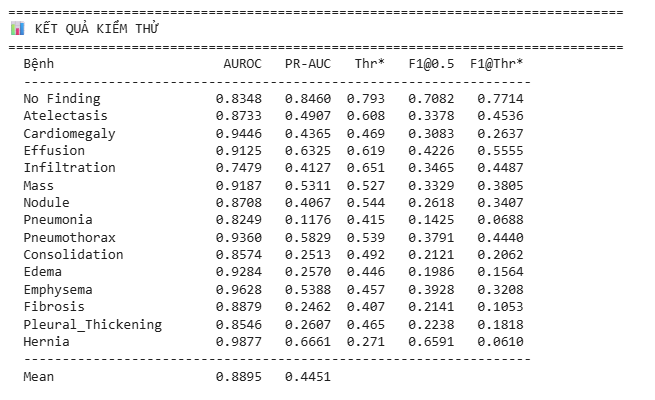 | 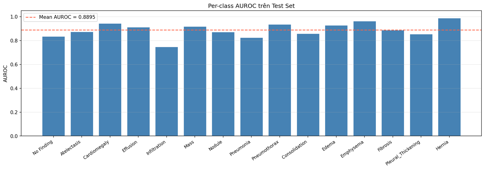 |
| **Đường Cong ROC 15 Lớp Bệnh** | **Đường Cong Precision-Recall (PR Curves)** |
| 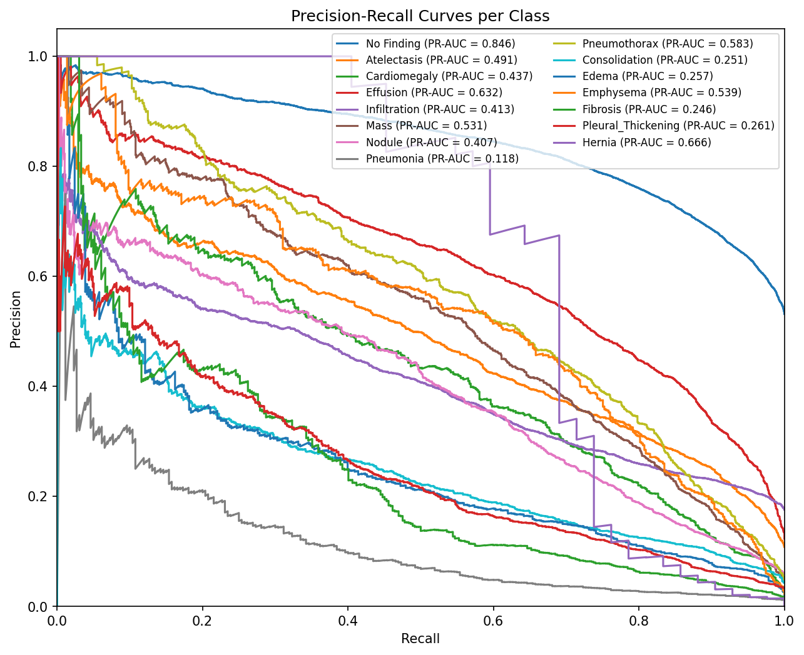 | 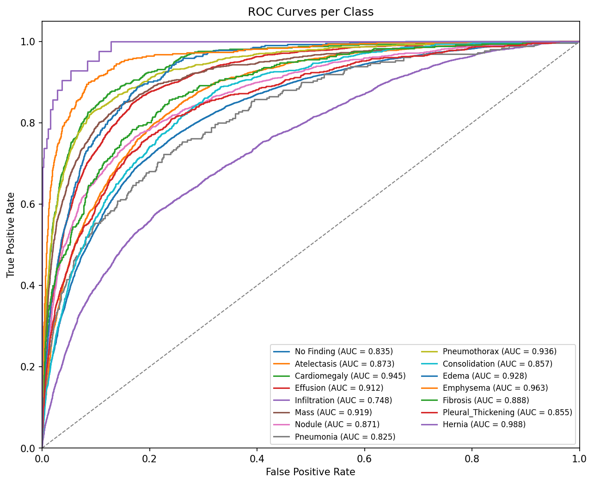 |
| **Ma Trận Nhầm Lẫn 15 Bệnh (Confusion Matrix Grid)** | **Phân Phối Xác Suất Dự Đoán (Positive vs Negative)** |
| 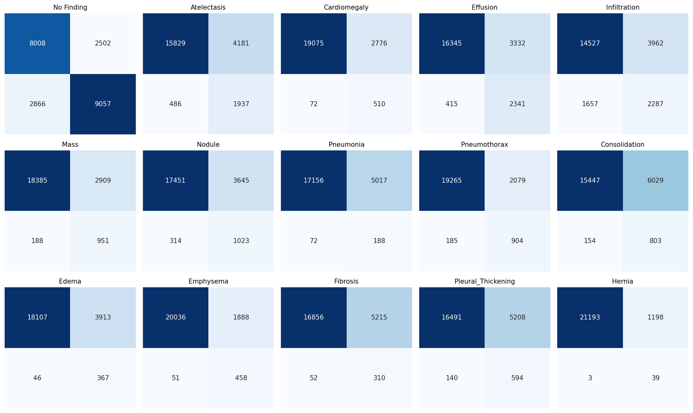 | 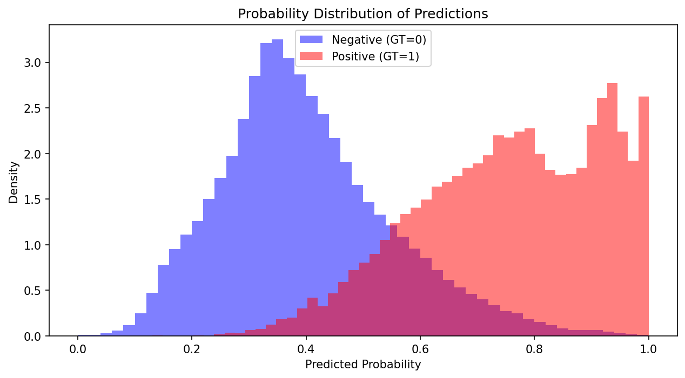 |
| **Ma Trận Nhầm Lẫn Tổng Hợp** | **Điểm F1 Trung Bình Theo Ngưỡng Quyết Định** |
| 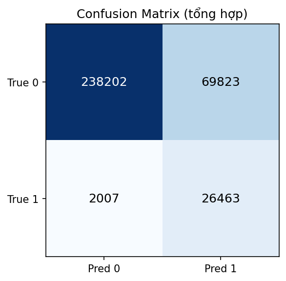 | 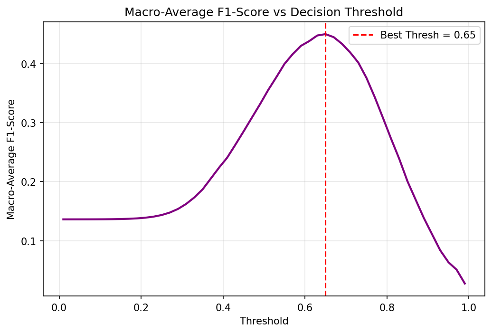 |

---

### 2. Đánh giá trên tập dữ liệu Hybrid (NIH + VinDr-CXR) (Mean AUROC: 0.8758)

Tập dữ liệu kết hợp giữa **VinDr-CXR** (ảnh có bounding box chất lượng cao được dán nhãn bởi nhiều bác sĩ chẩn đoán hình ảnh) và **NIH Chest X-ray**.

#### Bảng thông số chi tiết từng bệnh lý:

| STT | Bệnh lý | AUROC | PR-AUC | Ngưỡng tối ưu (Thr*) | F1 @ 0.5 | F1 @ Thr* |
|:---:|:---|:---:|:---:|:---:|:---:|:---:|
| 1 | **No Finding** | 0.8346 | 0.8703 | 0.815 | 0.7411 | **0.7803** |
| 2 | **Atelectasis** (Xẹp phổi) | 0.8567 | 0.4298 | 0.584 | 0.3147 | **0.3948** |
| 3 | **Cardiomegaly** (Phì đại tim) | **0.9361** | 0.6475 | 0.485 | 0.4215 | 0.3983 |
| 4 | **Effusion** (Tràn dịch màng phổi) | 0.9048 | 0.5924 | 0.605 | 0.4098 | **0.5161** |
| 5 | **Infiltration** (Thâm nhiễm) | 0.7425 | 0.3652 | 0.648 | 0.3379 | **0.4106** |
| 6 | **Mass** (Khối u) | 0.8980 | 0.4255 | 0.537 | 0.3106 | **0.3724** |
| 7 | **Nodule** (Nốt mờ) | 0.8533 | 0.3606 | 0.524 | 0.2453 | **0.2866** |
| 8 | **Pneumonia** (Viêm phổi) | 0.7893 | 0.0409 | 0.393 | 0.0858 | 0.0581 |
| 9 | **Pneumothorax** (Tràn khí màng phổi) | 0.8965 | 0.3750 | 0.481 | 0.3457 | 0.3231 |
| 10 | **Consolidation** (Đông đặc) | 0.8537 | 0.2399 | 0.504 | 0.2066 | 0.2109 |
| 11 | **Edema** (Phù phổi) | 0.9110 | 0.1731 | 0.405 | 0.1835 | 0.1225 |
| 12 | **Emphysema** (Khí phế thũng) | **0.9521** | 0.3930 | 0.413 | 0.3382 | 0.1982 |
| 13 | **Fibrosis** (Xơ hóa phổi) | 0.8838 | 0.5037 | 0.453 | 0.3359 | 0.2504 |
| 14 | **Pleural Thickening** (Dày màng phổi) | 0.8705 | 0.4361 | 0.488 | 0.2794 | 0.2639 |
| 15 | **Hernia** (Thoát vị hoành) | **0.9546** | 0.4635 | 0.232 | 0.5397 | 0.0288 |
| **—** | **Trung bình (Mean)** | **0.8758** | **0.4211** | **—** | **—** | **—** |

#### Các biểu đồ trực quan hóa kết quả kiểm thử trên tập Hybrid:

| Bảng Tổng Hợp Chỉ Số | Phân Phối AUROC Theo Từng Bệnh Lý |
|:---:|:---:|
| 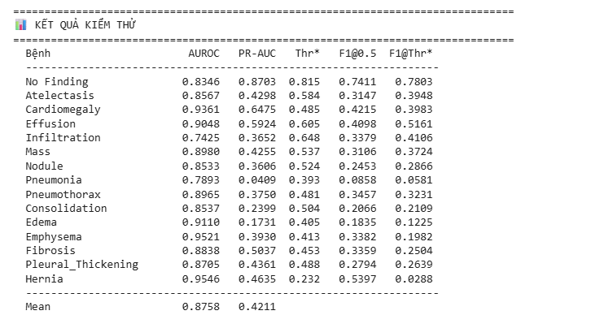 | 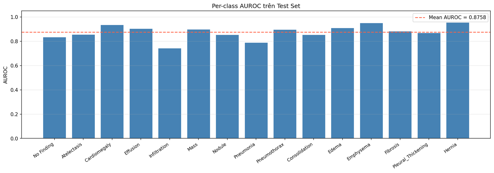 |
| **Đường Cong ROC 15 Lớp Bệnh** | **Đường Cong Precision-Recall (PR Curves)** |
| 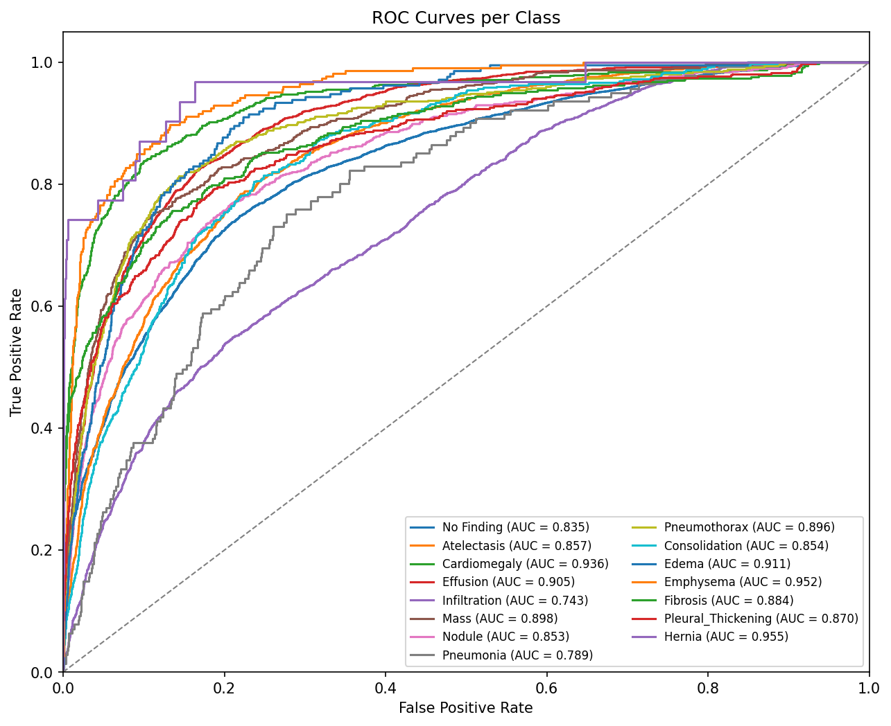 | 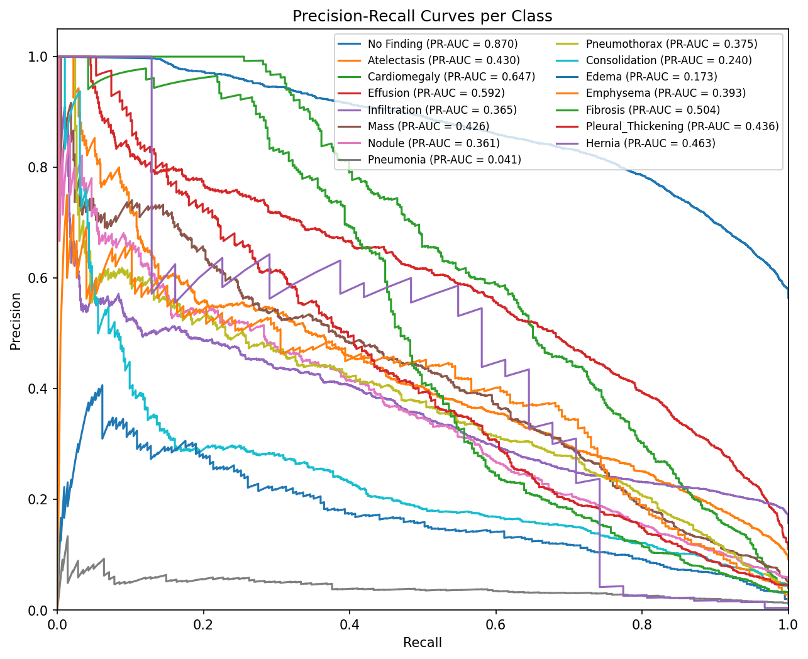 |
| **Ma Trận Nhầm Lẫn 15 Bệnh (Confusion Matrix Grid)** | **Phân Phối Xác Suất Dự Đoán (Positive vs Negative)** |
| 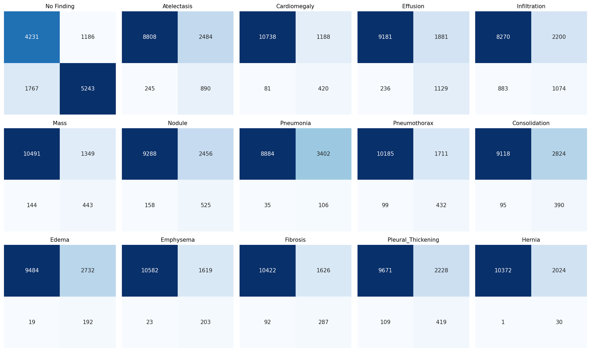 | 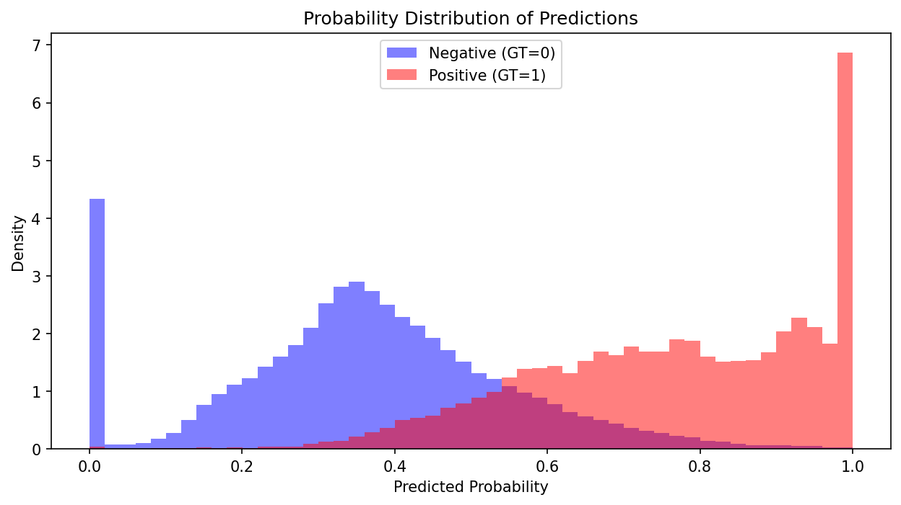 |
| **Ma Trận Nhầm Lẫn Tổng Hợp** | **Điểm F1 Trung Bình Theo Ngưỡng Quyết Định** |
| 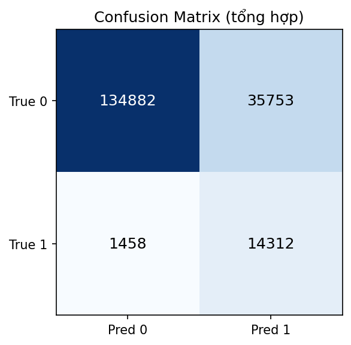 | 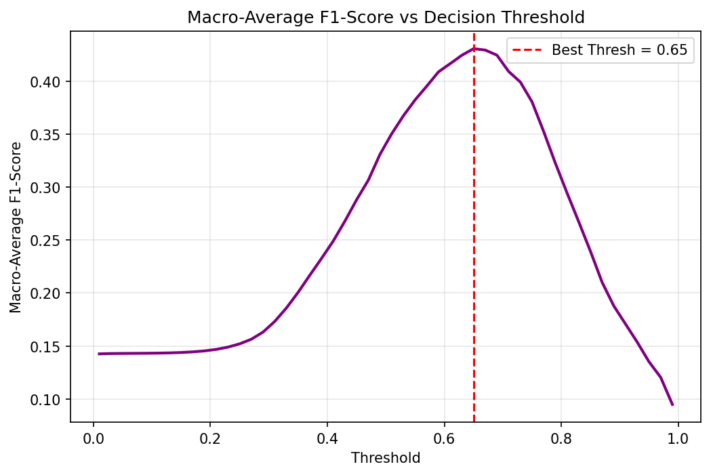 |

---

## 🏆 Thử Nghiệm Demo Đa Mô Hình (Results/EX)

Trong thử nghiệm thực tế với ca bệnh mẫu tại [`Results/EX/Cardiomegally.png`](Results/EX/Cardiomegally.png), hệ thống thực thi quy trình suy luận kết hợp **CheXNet Hybrid CNN-ViT + YOLO11m** và tự động trích xuất **tất cả các bệnh lý có điểm tin cậy cao nhất thỏa mãn điều kiện có Bounding Box**:

### 1. Thông số thực thi & Danh sách bệnh có Bounding Box:
- **Tệp ảnh**: `Cardiomegally.png` (828 KB, 1024×1024 px).
- **Tài nguyên GPU VRAM**: **1.21 GB** (NVIDIA RTX 3050 Laptop).
- **Các bệnh lý phát hiện thỏa mãn điều kiện CÓ Bounding Box**:
  1. **Cardiomegaly (Phì đại tim)**:
     - Xác suất phân loại CheXNet: **83.16%**
     - Độ tin cậy YOLO11m: **65.57%**
     - Điểm liên hợp Cascade: **54.53%**
     - Tọa độ BBox: `[x1=326, y1=549, x2=941, y2=830]` (Viền xanh lá ngọc).
  2. **Effusion (Tràn dịch màng phổi)**:
     - Xác suất phân loại CheXNet: **78.46%**
     - Độ tin cậy YOLO11m: **20.06%**
     - Điểm liên hợp Cascade: **15.74%**
     - Tọa độ BBox: `[x1=48, y1=733, x2=149, y2=845]` (Viền xanh da trời).
- *(Lưu ý: Các bệnh lý như Atelectasis hay Infiltration dù có xác suất phân loại cao nhưng không có Bounding Box từ YOLO11m sẽ không được đưa vào danh sách định vị tổn thương theo đúng tiêu chí khắt khe)*.

### 2. Kết quả trực quan hóa Display Fusion:

Hệ thống tự động xuất ra 3 định dạng hình ảnh chuẩn hóa lưu tại thư mục [`Results/EX/`](Results/EX/):

| 1. Bounding Box YOLO11m Độc Lập | 2. Display Fusion Độc Lập |
|:---:|:---:|
| 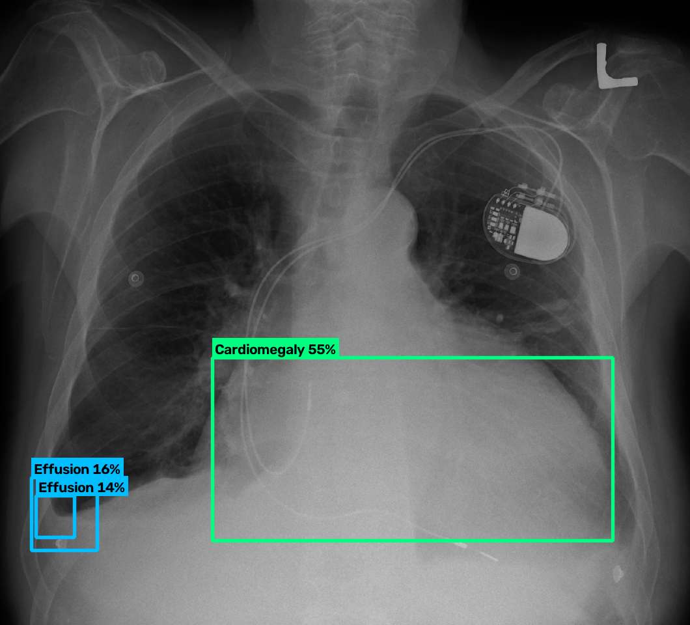 | 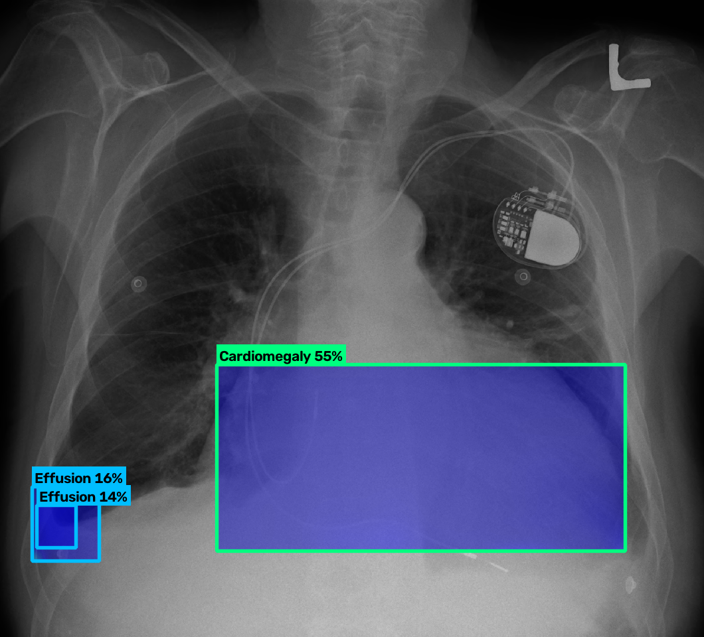 |
| *Khung bao định vị các bệnh lý có BBox (Cardiomegaly & Effusion)* | *Heatmap Grad-CAM lồng ghép bên trong từng Bounding Box riêng biệt* |

#### Bảng tổng hợp chẩn đoán 3 khung hình:
Tệp kết quả tổng hợp được lưu tại [`Results/EX/Cardiomegally_predict.png`](Results/EX/Cardiomegally_predict.png):

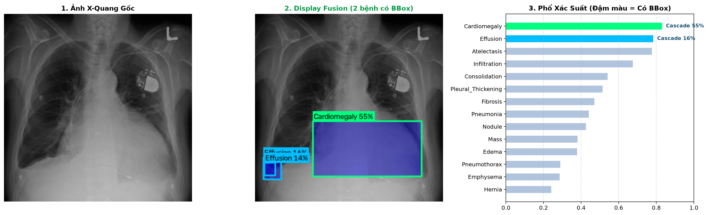

*Cấu trúc hiển thị 3 khung hình:*
1. **Khung 1 (Ảnh gốc)**: Phim chụp X-quang ban đầu từ bệnh nhân.
2. **Khung 2 (Display Fusion Đa Bệnh)**: Heatmap vùng chú ý Grad-CAM của từng bệnh được khoanh vùng chuẩn xác **bên trong Bounding Box tương ứng** (Tim to viền xanh lá, Tràn dịch màng phổi viền xanh da trời).
3. **Khung 3 (Phổ xác suất)**: Biểu đồ ngang làm nổi bật các bệnh **CÓ Bounding Box** kèm điểm liên hợp Cascade, trong khi các bệnh không có BBox được hiển thị màu nhạt.

---

## 🚀 Hướng Dẫn Khởi Chạy & Trải Nghiệm Demo

### Bước 1: Cài đặt Môi trường
Yêu cầu Python >= 3.10 và GPU hỗ trợ CUDA (hoặc chạy trên CPU):
```powershell
# Cài đặt các gói thư viện phụ thuộc
pip install -r requirements.txt
```

Đảm bảo hai file trọng số đã có sẵn trong thư mục `Trainedmodel/`:
- `CheXNet\Trainedmodel\hybrid_model.pth` (2.23 GB)
- `CheXNet\Trainedmodel\yolov11m.pt` (161 MB)

---

### Bước 2: Chạy Demo CLI (Đa Mô Hình Kèm Bounding Box)
Chạy script suy luận mẫu tối ưu VRAM (sử dụng cả CheXNet + YOLO11m, trích xuất tất cả các bệnh lý có điểm tin cậy cao nhất thỏa mãn điều kiện có Bounding Box):
```powershell
# Tự động quét và xử lý ảnh thử nghiệm trong Results/EX (mặc định Cardiomegally.png)
python run_predict.py

# Hoặc truyền đường dẫn tới bất kỳ file ảnh X-quang nào
python run_predict.py duong_dan_anh.png
```
*Kết quả dạng bảng phân tích và 3 tệp ảnh riêng biệt (ảnh BBox độc lập, ảnh Display Fusion độc lập, ảnh tổng hợp 3 khung) sẽ được tự động lưu vào thư mục `Results/EX/`.*

---

### Bước 3: Chạy Dự Đoán Tương Tác Ảnh Bất Kỳ
Nếu muốn mở giao diện dòng lệnh tương tác tùy biến ngưỡng, kích thước ảnh và phân tích toàn bộ 15 bệnh lý:
```powershell
python predict_single.py
```
- Nhấn `Enter` để sử dụng cấu hình mặc định (tự động nạp `Trainedmodel/hybrid_model.pth`, kích thước `large`, 384px).
- Dán đường dẫn ảnh X-quang cần kiểm tra để xem toàn bộ 15 xác suất bệnh.

---

### Bước 4: Khởi Chạy Full-Stack Serving (FastAPI + React UI)

Hệ thống hỗ trợ giao diện Web chẩn đoán đầy đủ dành cho phòng khám và bệnh viện:

#### 1. Khởi động Backend Server (FastAPI):
Từ thư mục gốc `CheXNet`:
```powershell
python -m uvicorn Backend.main:app --host 127.0.0.1 --port 8000
```
Kiểm tra trạng thái server:
```powershell
# Trên PowerShell Windows (dùng curl.exe hoặc Invoke-RestMethod)
curl.exe -s http://127.0.0.1:8000/
# Phản hồi: {"status":"online","model_loaded":true,"yolo_loaded":true,"device":"cuda"}
```

#### 2. Khởi động Frontend Client (React Vite):
Mở một cửa sổ dòng lệnh khác:
```powershell
cd Frontend
npm install
npm run dev
```
Truy cập trình duyệt tại địa chỉ: `http://localhost:5173` để trải nghiệm:
- **Kéo & Thả ảnh X-quang**: Xem Viewer ảnh kép (Ảnh gốc ⟷ Heatmap Display Fusion).
- **Thẻ phát hiện YOLO11m**: Hiển thị vị trí bounding box và điểm cascade.
- **Báo cáo y khoa Tiếng Việt**: Tự động tổng hợp kết luận và khuyến nghị điều trị.
- **Dynamic Growth (CBIR)**: Bấm lưu ca bệnh vào cơ sở dữ liệu vector FAISS cục bộ.

---

## 📚 Danh Mục Bệnh Lý Nhận Diện

Hệ thống phân loại và định vị 15 nhãn bệnh lý lồng ngực theo tiêu chuẩn quốc tế:

| STT | Tên tiếng Anh | Tên tiếng Việt | Mức độ lâm sàng |
|:---:|:---|:---|:---:|
| 0 | **No Finding** | Không phát hiện bất thường | Bình thường |
| 1 | **Atelectasis** | Xẹp phổi | Trung bình |
| 2 | **Cardiomegaly** | Phì đại bóng tim (Tim to) | Nguy cơ cao |
| 3 | **Effusion** | Tràn dịch màng phổi | Nguy cơ cao |
| 4 | **Infiltration** | Thâm nhiễm nhu mô phổi | Trung bình |
| 5 | **Mass** | Khối u phổi (> 3cm) | Cần sinh thiết |
| 6 | **Nodule** | Nốt mờ phổi (≤ 3cm) | Cần theo dõi |
| 7 | **Pneumonia** | Viêm phổi | Khẩn cấp |
| 8 | **Pneumothorax** | Tràn khí màng phổi | Cấp cứu tối khẩn |
| 9 | **Consolidation** | Đông đặc phế nang | Nguy cơ cao |
| 10 | **Edema** | Phù phổi cấp | Nguy cơ cao |
| 11 | **Emphysema** | Khí phế thũng | Bệnh mạn tính |
| 12 | **Fibrosis** | Xơ hóa phổi | Bệnh mạn tính |
| 13 | **Pleural Thickening** | Dày màng phổi | Theo dõi |
| 14 | **Hernia** | Thoát vị hoành | Hiếm gặp |

---

## ⚖️ Tuyên Bố Miễn Trừ Trách Nhiệm Y Tế (Medical Disclaimer)
*CheXNet Pro AI là hệ thống nghiên cứu khoa học và hỗ trợ ra quyết định lâm sàng (CADx). Mọi kết quả dự đoán, bản đồ nhiệt và gợi ý chẩn đoán chỉ mang tính chất tham khảo cho bác sĩ và chuyên gia y tế, không thay thế cho kết luận chẩn đoán xác định từ bác sĩ chuyên khoa chẩn đoán hình ảnh.*

